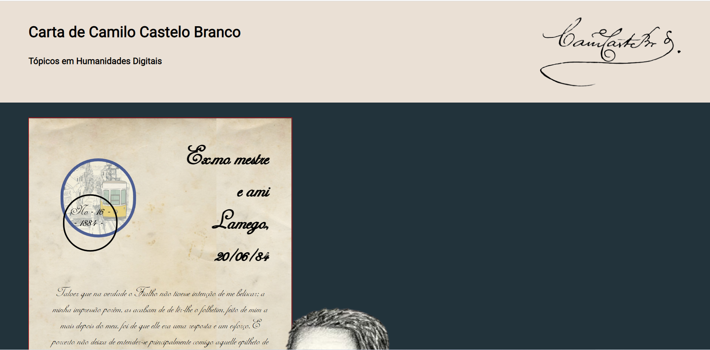
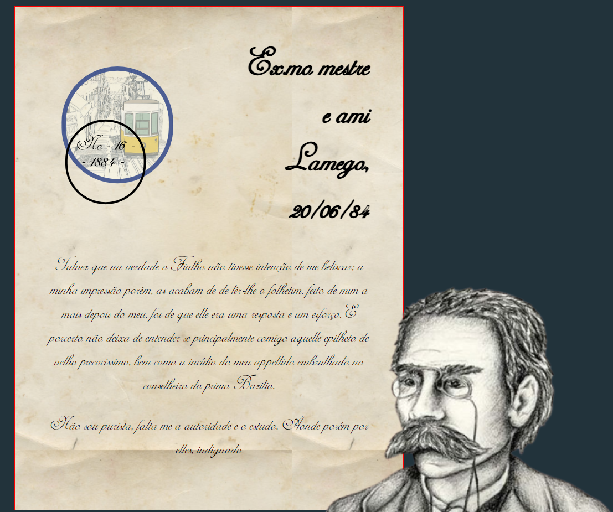

# Carta de Camilo Castelo Branco

Esta é a minha submissão para a cadeira de Tópicos de Humanidades digitais para a Carta Web de Camilo Castelo branco

## Preview

### Página Web

### Carta Web

## Abrir a página

A página pode ser aberta por:

- Página HTML
- Servidor Local

## Tecnologias

- Figma: Mockup

- HTML: Estrutura

- CSS: Estilo

## Figma
Utilizei o Figma para desenvolver o mockup da página web

[Link para o Mockup (Figma)](https://www.figma.com/file/6pLVtYKJhHLbJ5yaF3BayV/Carta-Web?node-id=24%3A39&t=eDv9a9QMV6B17N9p-1)

## License

[MIT](https://choosealicense.com/licenses/mit/)